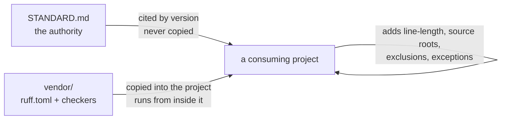

# Engineering conventions

A small, durable engineering standard for Python projects, and the minimum
tooling that makes it checkable.

It is built to travel.

Nothing in it names a project, a domain, a company, or a machine.

## The one idea that shapes everything else

**The standard is referenced by version; the enforcement is copied.**



A copied authority drifts: six months later two projects hold two texts, both
called the standard, differing in ways nobody decided.

Citing a version instead lets a reviewer answer the only question that
matters — is this difference a violation, or a version gap?

Enforcement is the reverse.

A project's gate must not depend on a path outside the project, its reviewers
must see the rules in its own diff, and its checks must keep working when this
repository is not reachable.

## What is here

```text
engineering-conventions/
├── STANDARD.md          the authority — cite this by version, do not copy it
├── CHANGELOG.md         versions, so a project can say which one it follows
├── LICENSE              Apache-2.0
├── NOTICE               a copyright line, kept where §4(d) carries it forward
├── pyproject.toml       this repository's own configuration
├── .taplo.toml          its TOML formatting, copied from vendor/taplo/
├── Makefile             this repository's own gate
├── docs/
│   ├── adoption.md      how a project adopts it: minimal path and full path
│   ├── versioning.md    what the version means, and what a change costs
│   └── workflow.md      how to audit an existing codebase against it, once
├── vendor/              the only directory a project copies
│   ├── ruff/            linter and formatter configuration templates
│   ├── taplo/           TOML formatter configuration template
│   └── tools/           the two checkers, standard library only
└── sandbox/             a complete tiny project that has adopted the standard
```

## Checking a project without copying anything

The same checker audits a project from outside it.

```sh
python3 vendor/tools/check_conventions.py --project /path/to/project src tests
```

It reads that project's `[tool.check-conventions]` table, resolves paths there,
and prints the standard version alongside the findings.

The result is identical to running the vendored copy from inside the project,
which is the property that makes the two interchangeable rather than two
different checks.

## The sandbox

`sandbox/` is a working miniature project, not a code listing.

It has its own `pyproject.toml`, its own `Makefile`, a vendored copy of the
checker under `tools/`, and a `counterexamples/` directory that its gate
deliberately excludes.

Reading it answers the questions the prose cannot: where project-local
settings go, what a recorded exception looks like, and what the checker prints
when it finds something.

```sh
cd sandbox && make verify
```

```sh
cd sandbox && make demo-violation
```

The second command points the checker at the counterexamples the gate skips.

It is a demonstration and a positive control at the same time.

## Where the rules come from

Two external authorities, narrowed but never contradicted:

- **Commit messages** — the Conventional Commits convention at
  <https://gist.github.com/qoomon/5dfcdf8eec66a051ecd85625518cfd13>
- **Comment markers** — the vocabulary of
  <https://github.com/folke/todo-comments.nvim>

`STANDARD.md` §1 sets out the precedence between those, this standard, a
project's own decisions, and the semantics of the language and its libraries.

## Adopting it

**Minimal**, for a project that wants the rules enforced and nothing else:

1. Copy `vendor/ruff/ruff.toml` to the project root.
2. Add the project's own `line-length` and `src` to it.
3. Run `ruff check` and `ruff format --check` in the project's gate.

**Full**, adding the rules no formatter can express:

4. Copy `vendor/tools/check_conventions.py` into the project's tooling
   directory, and record the commit it came from.
5. Add it to the gate, with `--self-test` running first.
6. Cite the standard's version in the project's contributor documentation.

`docs/adoption.md` has the detail: which files are reference material and never
copied, how to layer project configuration without editing the vendored files,
and how to record a project-specific exception.

## Reading it for the first time

`STANDARD.md` top to bottom takes about fifteen minutes.

Section 2 is the one to read even if nothing else is: it is about when a rule
is allowed to exist at all, and its absence is the most expensive gap a
codebase can have.

## This repository follows its own standard

```sh
make setup && make verify
```

`make setup` creates the environment from `uv.lock`, and every tool in the gate
runs inside it.

A bare `ruff` or `pytest` would resolve to whatever the shell happened to offer,
which is how a run reports green against versions the manifest does not
accept.

That runs the formatter check, the linter, the type checker, the conventions
checker against this repository's own Python, Markdown, and Makefiles, a drift
check that the vendored copies still match what `vendor/` publishes, a proof
that every counterexample is still caught, and the sandbox tests.

The one exception is `sandbox/counterexamples/`, which breaks the rules on
purpose.

`STANDARD.md` §1 explains why that is legitimate and how such material must be
marked.

Continuous integration runs the same gate on every push to `main` and every pull
request, on the lowest Python `requires-python` allows and on the newest.

## License

Apache-2.0.

The `NOTICE` file is a choice rather than a requirement: the license asks that
copyright and attribution notices be preserved, and its §4(d) applies only
once a project has a `NOTICE` file for a derivative to carry forward.

Keeping one is how the copyright line reaches anyone who builds on this.

The license was chosen over a shorter permissive one for §4(b): a modified
file must say that it was modified, so a changed standard cannot circulate as
this one.
