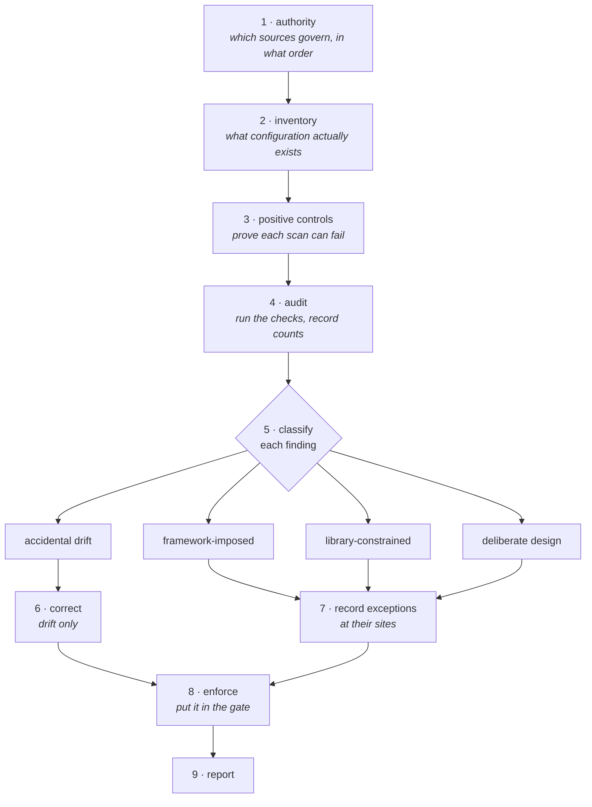

# Auditing an existing codebase

The first pass against an established codebase is different from ongoing work.

The rules are new, the code is not, and most of what a tool reports is neither
a bug nor a violation.

This is the procedure that keeps that pass from becoming either a rubber stamp
or a rewrite.

## The stages

Stage 3 is the one most often skipped, and skipping it invalidates everything
after it.

Stage 5 carries the work: only one of the four buckets is ever corrected.

**1. Establish authority.**

Write down which sources govern and in what order, before looking at any code.

Without this, every finding becomes an argument about whether the rule is
real.

**2. Inventory.**

Discover what configuration actually exists rather than assuming a standard
layout.

Manifest, linter, formatter, type checker, test runner, container definitions,
task runner, ignore files, CI.

The absence of a file is a finding: a project with no CI has no automated
gate, and that changes what "enforced" can mean.

**3. Establish positive controls.**

Before running any scan, prove the scan can fail.

This stage is skipped more often than any other and it invalidates everything
downstream.

**4. Audit.** Run the checks.

Record counts, not impressions.

**5. Classify every finding.**

This is the stage that carries the work.

Four buckets, and the difference between them is the whole point:

- **Framework-imposed** — a signature a framework inspects and calls itself, a
  parameter name a decorator binds.
  There is no caller to protect and no decision to make.
  Not a violation, and not an exception either: the rule simply does not reach
  it.
- **Library-constrained** — the external API is what it is.
  A compiled extension that takes positional arguments only does not become
  keyword-capable because the standard prefers keywords.
  Record it at the site so the next pass does not undo it.
- **Deliberate design** — someone decided this, for a reason that still holds.
  Find the reason.
  If it cannot be found, it is the next bucket.
- **Accidental drift** — nobody decided it; it accumulated.
  This is the only bucket that gets corrected.

**6. Correct only the drift.**

Everything else is recorded or left alone.

**7. Record exceptions at their sites.**

Never in a central list, which nobody reads and which goes stale the first
time a file moves.

**8. Enforce what can be enforced.**

Put the mechanical rules in the gate so this audit does not have to happen
again.

**9. Report.**

Short, with counts and with the unresolved decisions named.

## How to tell drift from a decision

Ask what would have to be true for the code to be right.

A signature that mixes positional and keyword parameters is a claim that some
arguments are structural and some are configuration.

If the claim is true, the signature is deliberate and the missing marker is
drift — add the marker and the signature now states what was already meant.

If the claim is false, the signature is drift entirely.

An import that shadows a builtin is a claim that the shadowing does not matter
here.

That claim is almost never made on purpose.

**Look for corroboration in the codebase itself.**

A pattern used seventy times and violated twice is a convention with two
stragglers.

A pattern used twice is not yet a convention, and making it one is a decision,
not a correction.

**Do not normalize drift into an exception.**

"It has always been like that" is a description of how it got there, not a
reason for it to stay.

If the reason cannot be stated, it is drift.

## When to stop and ask

Stop when the fix requires deciding what the system is supposed to do.

The signal is precise: you are about to write a rule that no existing document
supports, and the reason you are writing it is that a check is failing.

That is the moment the decision leaves engineering.

Specifically, stop when:

- The correction would add a semantic rule — a filter, a threshold, an
  exclusion — that no requirement states.
- Two governing documents disagree and only one can be followed.
- The correction would weaken a test, or change what a test asserts, to make
  it pass.
- The correction changes stored data, an external contract, or a published
  interface.

Stopping costs one round trip.

Not stopping installs a decision nobody made, in a place nobody will look.

## Not turning observations into rules

This is the failure mode that survives review, because the resulting code
looks correct on every input anyone has examined.

The discipline is in `STANDARD.md` §2 and is not repeated here.

The audit-time form of it is short:

> A rule derived from the sample cannot be tested by the sample.

When a check fails on two values and both look like garbage, the pull toward
"exclude values that look like that" is strong, and the resulting filter will
be correct until the day it deletes something real.

Name an input the rule would classify wrongly.

If none comes to mind, the rule is a description of what was observed.

## Positive controls

**Every automated check needs a case it is known to catch, run beside the real
one.**

Three failures that all present as a clean result:

- A pattern that is invalid for the tool reading it.
  An unbalanced parenthesis in an extended regular expression makes the search
  error, and a pipeline that swallows the error reports nothing found.
- A resolution strategy that skips what it cannot resolve.
  An audit that maps names to signatures globally and skips every name defined
  twice will silently exclude exactly the ambiguous cases most likely to be
  wrong.
- A check that reads a different layer than the claim.
  Inspecting a buffer to establish what a viewer sees, or reading source to
  establish runtime behavior.

The remedy is the same in all three: run the check against something it must
find.

`check_conventions.py --self-test` is the shape — a snippet per construct,
known to violate the rule it names, failing loudly if the violation is not
reported.

One snippet per check would prove only that each check can fire at all, which
is a weaker claim than it looks: a check covering several constructs can stop
reaching one of them while its single control still passes.

## The report

One page.

It is read by someone deciding what to do next, not by someone reliving the
audit.

- **A table**: area, status (conforming / violation / exception), what happened.
- **Counts**, not adjectives.
  "Twenty-one violations across thirteen files" says something; "several
  issues" does not.
- **Corrections applied**, each traceable to a rule.
- **Exceptions recorded**, each with its bucket from stage 5.
- **Decisions required**, stated as questions with their consequences.
  These go near the top, not in an appendix.
- **Verification**, including what failed.
  A qualified result is worth more than a confident one, and an audit that
  reports everything green is the one to distrust.
