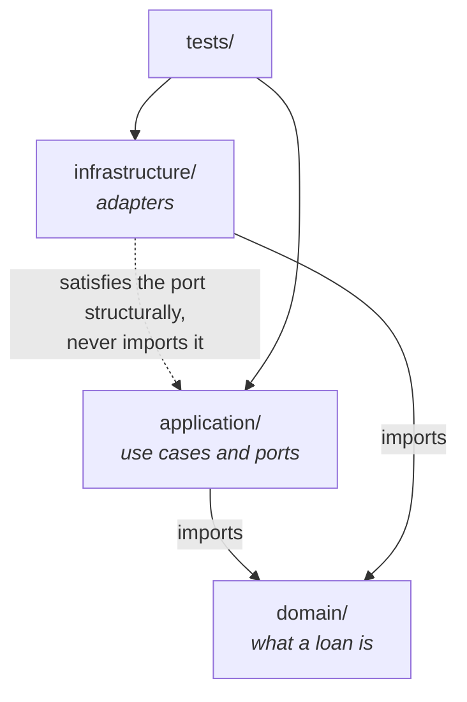

# Sandbox

A complete miniature project that has adopted the standard.

It is not a starter template, and it exists so that adoption can be read
rather than only described.

The domain is library lending, chosen because it is familiar enough that the
domain never distracts from the form.

```sh
make verify
```

```sh
make demo-violation
```

## Why it is layered

The layering is not the lesson, but it is what makes two of the lessons
possible.



The signature rule is about the boundary between what callers see and what
never escapes a module.

Without a boundary, a sandbox can show the rule's form but not its reason.

The adapter is where an external library's real signature has to be respected,
which is the standard's most expensive rule to learn the hard way and had no
example here until the layer existed.

## What it demonstrates

| Question the prose cannot answer | Where to look |
| --- | --- |
| Where do project-local settings go? | `pyproject.toml`, under the comment marking the vendored half from the local half. |
| What does a vendored checker look like in place? | `tools/check_conventions.py`, byte-identical to `vendor/tools/`. |
| How is an exception recorded? | `pyproject.toml`, the two `extend-exclude` entries and the `WARN:` above them. |
| What does respecting a library's real signature look like? | `src/library/infrastructure/csv_loan_export.py`, and the `WARN:` inside it. |
| What does a public boundary look like? | `application/ports/loan_export.py` — keyword-only, a `Protocol`. |
| What does an internal helper look like? | `application/use_cases/export_the_loans.py`, `_select` — positional-only subject, keyword-only configuration. |
| What does the checker print? | `make demo-violation`. |
| How is the gate wired? | `Makefile` — the positive control runs before the scan. |

## The `csv.writer` lesson is real, not illustrative

`csv.writer` is implemented in C and its first parameter is positional-only.

```text
csv.writer(handle)                  ok
csv.writer(csvfile=handle)          TypeError: writer expected at least 1 argument, got 0
csv.writer(handle, dialect="excel") ok
```

The error names neither the parameter nor the real problem, and every *other*
argument does accept a keyword.

That is why the standard's rule is per callable rather than per library, and
it is reproducible here with no dependency beyond the standard library.

## The two exclusions are not the same kind

`counterexamples/` breaks the conventions on purpose.

Correcting those files would destroy what they teach, and `STANDARD.md` §1 is
the rule that makes such material legitimate.

`tools/` holds a vendored file.

Formatting it here would rewrite it at this project's line length and destroy
the diff against the version this project follows.

One is teaching material; the other is somebody else's file.

Both are recorded where they apply, with the reason beside them.
